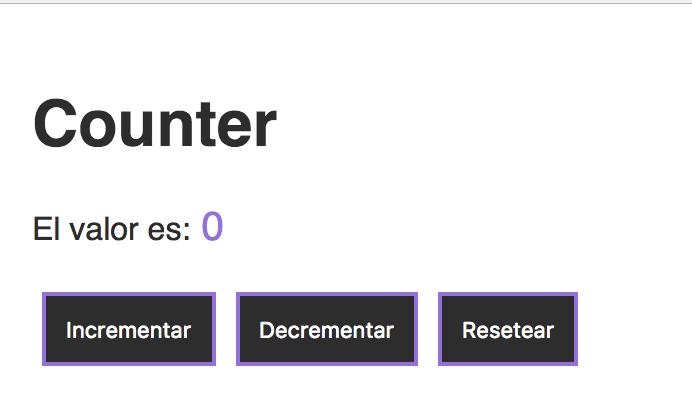
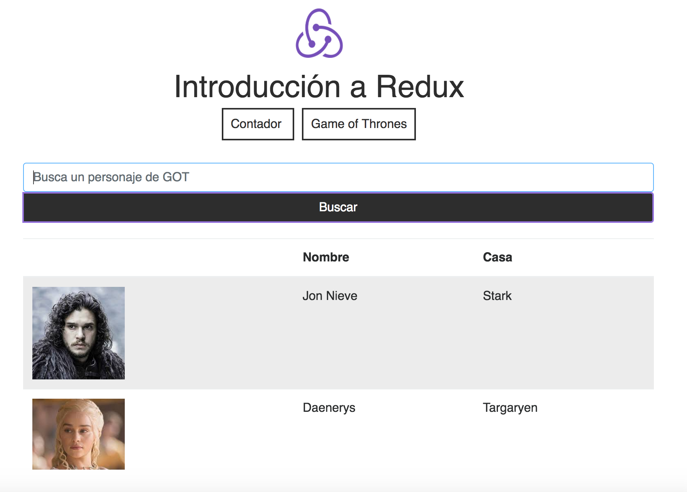

## Recursos necesarios

Para el desarrollo de la charla/taller, se recomienda que dispongas de las siguientes herramientas en el equipo informático donde vayas a trabajar:

- Gestor de versiones [Git](https://git-scm.com/)
- [NodeJS](https://nodejs.org/es/download/current/)
- Navegador web [Google Chrome](https://www.google.es/chrome/browser/desktop/index.html)
- Editor de código 

## Introducción

Este repositorio contiene el código necesario para llevar a cabo un taller de introducción a Redux utilizando React como librería de vistas para construir el frontend.

## Clonar y ejecutar el proyecto

npm start

```sh
$ git clone https://github.com/ivanbtrujillo/redux-tlp-2017.git
$ cd redux-tlp-2017 && npm i
```

### Rama master:
En el taller crearemos el ejemplo desde cero paso a paso en un livecoding. También está dividido en 7 pasos mediante el uso de tags, de forma que puedes moverte entre cada paso utilizando: **git checkout (tag)**.

Puedes ver la lista de tags del proyecto desde Github o mediante el comando:

```
git tag -l 
```
Ejemplos para moverte entre las tags:
```
git checkout 01
git checkout 02 
```

La aplicación desarrollada en esta rama es la siguiente:



### Rama redux-api-request: 
Tendremos un ejemplo un poco mas avanzado en el que se detalla el uso de Redux con
react-router integrándolo con una api a la que realizar peticiones http que cuando se resuelven, actualizan el state de nuestra app. 

Partimos de lo desarrollado en la rama master.

La aplicación desarrollada en esta rama es la siguiente:


#### Servidor (solo necesario para la rama redux-api-request)

Para gestionar las peticiones http desde el front con react-redux, debemos clonar el repositorio en el cual tenemos un JSON Server simple que dispone de una base de datos en un JSON con informacion de personajes de Game of Thrones.

**1. Instalar json-server de forma global:**
```
npm i -g json-server
```

**2. Clonar el repositorio:**

```
git clone https://github.com/ivanbtrujillo/redux-tlp-2017-server.git

```

**3. Instalar dependencias:**
```
cd redux-tlp-2017-server && npm install 
```

**4. Ejecutar el servidor en el puerto 4000 (en una ventana de consola diferente a la del front):**
```
json server --watch db.json --port 4000
```
